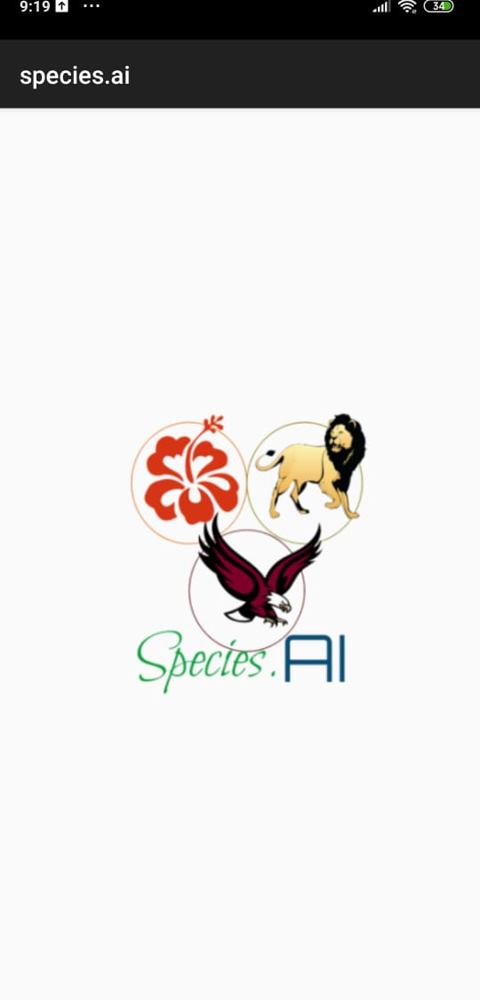
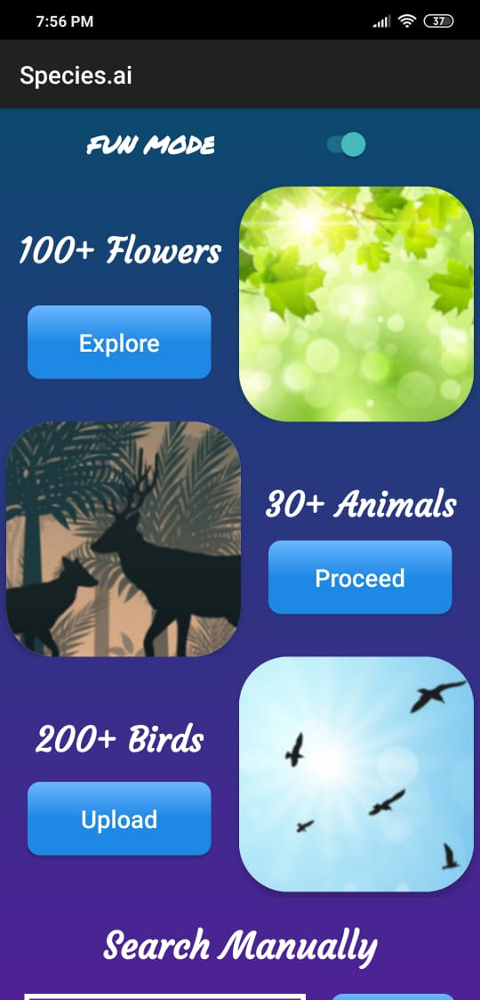

# Species.AI 
Deep Learning baseed android application for identifying flowers,birds,animals and providing general trivia. 

## Table of Contents

* [About the App](#about-the-app)
* [Installation](#installation)
* [Technologies](#Technologies)

## About the App

It allows the user to simply take a photo of any plant, animal, bird right at the moment or load it from the gallery and then, gives the top 3 predictions for the species along with providing some interesting information about them including their description, family and genus, nicknames, countries where they are found etc.  
Species.AI can classify around 350+ categories of various plants, flowers, animals and bird using deep learning models.
Also, the app gives prediction only in the case an actual species is present in the photograph. If, for example, an object or a human is detected, the app gives a "No species Found" message to the user.

<table>
  <tr>
    <td><b> App Logo </b></td>
     <td><b> Main Menu </b></td>
     <td><b> Testing a Bird Image </b></td>
  </tr>
  <tr>
    <td></td>
    <td></td>
    <td></td>
  </tr>
  <tr><td></td></tr>
  <tr>
    <td><b> Bird Info </b></td>
     <td><b> Testing a Flower </b></td>
     <td><b> Flower Info </b></td>
  </tr>
  <tr>
    <td></td>
    <td></td>
    <td></td>
  </tr>
 </table>

## Installation

* Use the apk file provided in the source code [here]() and install it on your android application
* Provide the required permissions to the application for taking pictures from the camera or gallery
* Select a species category, select a picture and click on predict to get the Top 3 predictions!
* Select the prediction you want to know more about

## Technologies
### For the deep learning model:
* Python
* Tensorflow
* Kaggle Kernel  
* Libraries like Numpy, Matplotlib, PIL etc.
### For the android application:
* Java
* Android Studio
* Tensorflow-Lite
* XML
